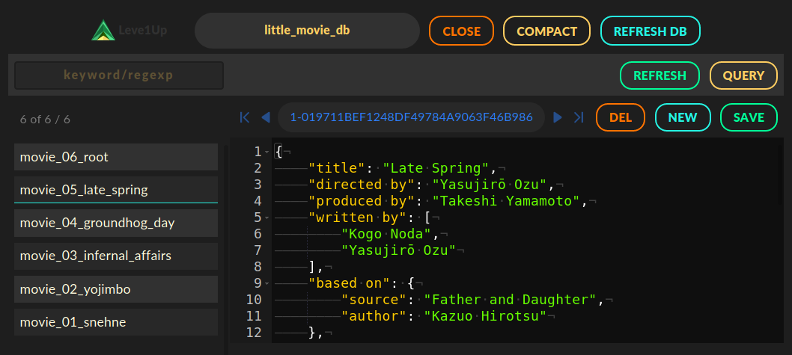
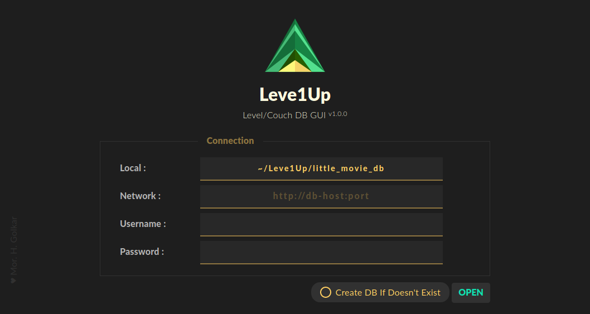

# []() Leve1Up

## Leve1Up
**NoSQL ( CouchDB, LevelDB ) Graphical User Interface**

* Shows up in Modern Browsers (doesn't need atom-shell, etc.)
* Developed on top of NodeJs, ExpressJs, PouchDB ...

### Getting Started
Make sure NodeJs and NPM are installed (Requirements .)   
Download this repository (git) and install it with dependencies (npm .)     
*These steps depend on your OS. Debian  e.g.*   
```
	$ git clone https://github.com/mhgolkar/Leve1Up.git ~/Leve1Up
	$ cd ~/Leve1Up
	$ npm install
```
Now you can run it as a NodeJS app (Debian e.g.):
```
	$ node ~/Leve1Up
```
or perhaps `$ node ~/Leve1Up/main.js`.


That's it all.   
The Leve1Up server side will run ( by default on `http://localhost:1234` ) and salutes you in the terminal.   
*Open the given address in your browser to use it.*  

To change host, port  or any other settings, you can edit `configs.js` file.  
If the port `1234` is being used by another app or service, you'll get an error. Simply change the port as mentioned.   
There is a very small LevelDB database in `./little_movie_db` shipped with the repository, which can be used locally to discover what Leve1Up can do.   

[]()

[]()

#### Notes
* you can **turn off the server side** by sending any GET request to a path specified in `configs.js` ( by default opening `http://localhost:1234/turn-off` does the job.)  

Have a nice time .
